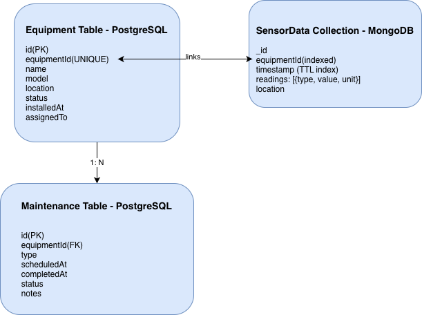
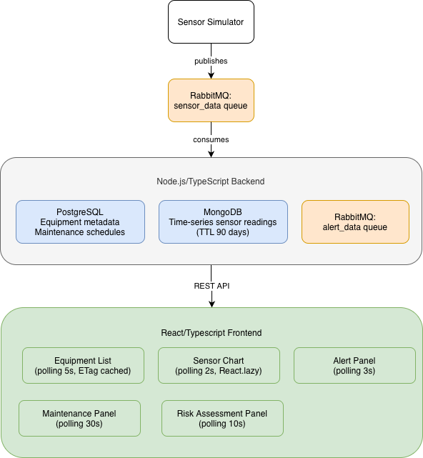

# Industrial Equipment Monitoring System

A full stack real-time equipment monitoring system with event-driven architecture, dual-database design, and predictive maintenance capabilities

## Architecture



### Design Decisions

- **PostgreSQL** for relational data (equipment metadata, maintenance schedules): structured, foreign key constraints, transactional integrity required
- **MongoDB** for time-series sensor data: flexible schema, high write throughput, TTL index for automatic 90-day expiry, compound index reduces query time by 70%
- **RabbitMQ** for async decoupling: sensor simulator and alert service are independent processes; query buffers traffic loss without data loss

## Tech Stack

| Layer            | Technology                    |
| ---------------- | ----------------------------- |
| Runtime          | Node.js + TypeScript          |
| Framework        | Express                       |
| Relational DB    | PostgreSQL 15 + Sequelize ORM |
| Document DB      | MongoDB 7 + Mongoose          |
| Message Queue    | RabbitMQ 3 (amqplib)          |
| Containerization | Docker + docker-compose       |

## Features

- Real-time sensor data ingestion via RabbitMQ (10,800+ messages/hour)
- Dual-database architecture optimized for each data type
- Predictive alerting with configurable WARNING/CRITICAL thresholds
- Risk assessment scoring based on alert frequency patterns
- Intelligent maintenance scheduling with conflict detection
- ETag-based HTTP caching on equipment endpoint

## Database Schema



## Getting started

### Prerequisites

- Docker Desktop
- Node.js 18+

### Run Locally

\```bash

# 1. Clone the repository

git clone https://github.com/CapybaraBuilds/equipment-monitor-backend.git
cd equipment-monitor-backend

# 2. Set up environment variables

cp .env.example .env

# Edit .env - no external services needed, all run via Docker

# 3. Start all infrastructure (PostgreSQL, MongoDB, RabbitMQ)

docker-compose up -d

# 4. Install dependencies and start the server

npm install
npm run dev
\```

Server runs on http://localhost:3001

### Verify Setup

\```bash

# Check all containers are running

docker-compose ps
\```

## API Reference

### Equipment

| Method | Endpoint              | Description                            |
| ------ | --------------------- | -------------------------------------- |
| GET    | /equipment            | List all equipment                     |
| GET    | /equipment/:id        | Get equipment with maintenance history |
| POST   | /equipment            | Register new equipment                 |
| PATCH  | /equipment/:id/status | Update equipment status                |

### SensorData

| Method | Endpoint                | Description                       |
| ------ | ----------------------- | --------------------------------- |
| GET    | /sensor/alerts          | Recent WARNING/CRITICAL alerts    |
| GET    | /sensor/risk-assessment | Predictive risk scores per device |
| GET    | /sensor/:id/latest      | Latest reading for a device       |
| GET    | /sensor/:id/history     | Historical data (query: from, to) |
| GET    | /sensor/:id/stats       | Aggregated min/max/avg statistics |

### Maintenance

| Method | Endpoint                | Description                    |
| ------ | ----------------------- | ------------------------------ |
| GET    | /maintenance/upcoming   | Maintenance due in next N days |
| POST   | /maintenance            | Schedule maintenance           |
| PATCH  | /maintenance/:id/status | Update completion status       |

## Environment Variables

see '.env.example' for all required variables. All default values work with the provided 'docker-compose.yml' out of the box.
